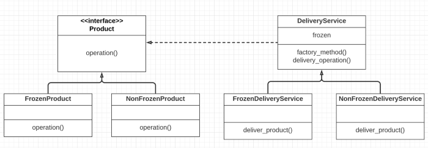

# Factory Method
We started our business by delivering cargo that didn’t need a temperature-controlled environment. We developed code for it and the entire code was in the class NonFrozenDeliveryService. But as the demand started rising, customers started requesting products that need a temperature-controlled environment. To address this, we created another class FrozenDeliveryService which had the code for delivering products that need temperature control. But the issue with this approach is now the client has to know what object to create for different types of products.

This is where the factory method pattern is useful. It makes sense to decouple client and delivery service. The client should pass minimal information and based on that DeliveryService should create the object for the right class. To illustrate it further, if you order something from Amazon, as a customer Amazon’s delivery system should be a blackbox for you.

As we see in the UML diagram, the interface Product is implemented by FrozenProduct and NonFrozenProduct. DeliveryService class is extended by FrozenDeliveryService and NonFrozenDeliveryService, representing type of product delivery. And going by definition subclasses FrozenDeliveryService and NonFrozenDeliveryService instantiate objects for FrozenProduct and NonFrozenProduct respectively.

